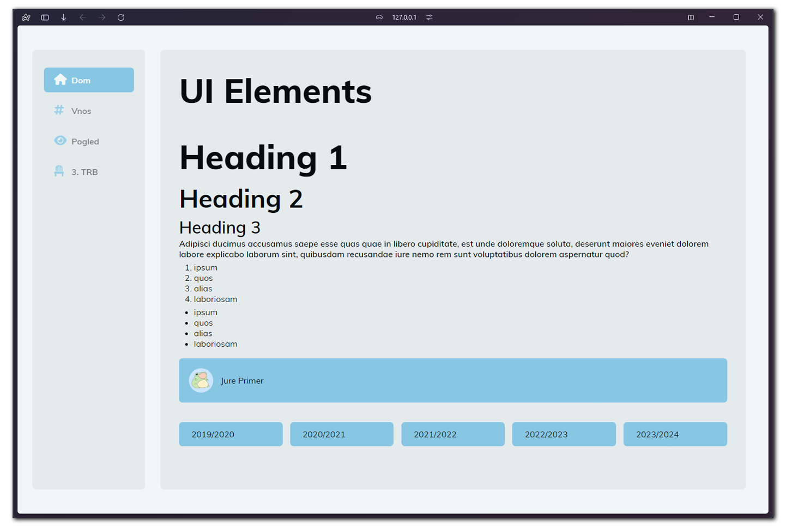

*Read this in other languages. By defualt this README is  in slovene.*
 

<kbd>[🇺🇸](https://github.com/Tomkov1c/SCVProjekt/blob/main/GitHub/README.en.md)</kbd>
<kbd>[🇸🇮](https://github.com/Tomkov1c/SCVProjekt/blob/main/README.md)</kbd>

# 🏫 Šolski Center Velenje - Projektna naloga

*Spletna aplikacija, ki je namenjena profesorjem Šolskega Centra Velenje, ki omogoča pregled nad dosežki, lestvicami za razne doseške, pregled med tekmovanji, ...*

## ✔️ Načrt razvijanja
- **Strani**
	- [x] Prijavna stran
	- [x] Začetna stran
	- [x] Glavna stran (dashboard)

- **Podstrani**
	- [x] Dom
	- [x] Admin
	- [x] Vnos
	- [x] Nastavitve
	- [ ] Obvestila

 

## ⌨️ Developerji
<table>
  <tbody>
    <tr>
     <td align="center" valign="top" width="14.28%"><a href="https://github.com/Tomkov1c"> <b>Tom Kliner</b></a> <a href="https://github.com//Tomkov1c/SCVProjekt/commits?author=Tomkov1c">Frontend, Izgled</a>  <i><q>Sovražim CSS</q></i></td>
      <td align="center" valign="top" width="14.28%"><a href="https://github.com/MarkieWasTaken"> <b>Mark Kotnik</b></a> <a href="https://github.com/Tomkov1c/SCVProjekt/commits?author=MarkieWasTaken">Backend, Frontend</a>  <i><q>Sovražim PHP</q></i></td>
		<td align="center" valign="top" width="14.28%"><a href="https://github.com/pungiu"> <b>Gal Pungartnik</b></a> <a href="https://github.com/Tomkov1c/SCVProjekt/commits?author=pungui">Backend, Frontend</a>  <i><q>Obožujem PHP</q></i></td>
    </tr>
  </tbody>
</table>
